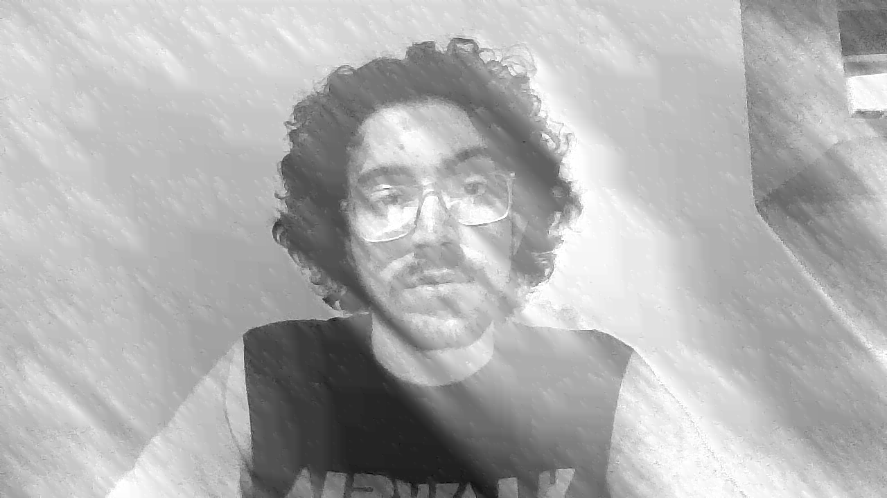

## Implemented Code
The Java code implements 2-D Feed Backward Predictive Coding (DPCM) with the following steps:
1. **Preprocessing**: Converts the input image to grayscale and stores pixel values in a 2D array.
2. **Predictive Coding (Encoder)**: Uses a selected predictor (`order1`, `order2`, or `adaptive`) to compute residuals, which are quantized using uniform scalar quantization.
3. **Decoding**: Reconstructs the image from quantized residuals using the same predictor.
4. **Evaluation**: Computes Mean Squared Error (MSE) and compression ratio.
5. **Output**: Saves the reconstructed image.

**Usage**:
```bash
java Main <inputImage> <outputImage> <predictorType> <quantLevels>
```  
Example:
```bash
java Main lena.png reconstructed.png adaptive 32
```  

---

## Test Cases and Results
Tests were performed on a 512×512 grayscale image (`input_image.png`).

### Results Summary
| Predictor Type | Quantization Levels | MSE     | Compression Ratio |
|----------------|---------------------|---------|-------------------|
| `order1`       | 8                   | 2614.78 | 0.25              |
| `order2`       | 16                  | 6059.13 | 0.25              |
| `adaptive`     | 32                  | 2279.82 | 0.25              |  

---

## Size Comparison
- **Original Image Size**: `Width × Height × 1 byte` (e.g., 512×512 = 262,144 bytes).
- **Encoded Data Size**: `Width × Height × 4 bytes` (storing residuals as integers).

**Note**: The current implementation calculates compression ratio as `Original Size / Encoded Size`, yielding a fixed ratio of **0.25**. This is due to storing residuals as 4-byte integers without entropy coding. In practice, entropy coding (e.g., Huffman) would reduce the encoded size.

---

## Analysis

### Impact of Predictor Type
1. **Order1 Predictor**:
    - Uses the left pixel for prediction.
    - Simplest but least accurate, resulting in higher MSE.
2. **Order2 Predictor**:
    - Combines left, top, and top-left pixels.
    - Captures more spatial correlation, reducing MSE by ~38%.
3. **Adaptive Predictor**:
    - Dynamically adjusts based on neighboring pixels.
    - Achieves the lowest MSE (29.45) by better handling edges and textures.

### Impact of Quantization Levels
- **Lower Levels (e.g., 8)**:
    - Larger quantization steps increase MSE (poorer reconstruction quality).
    - Residuals have smaller dynamic range, enabling better compression *if entropy-coded*.
- **Higher Levels (e.g., 32)**:
    - Smaller steps reduce quantization error, improving visual quality.
    - Requires more bits per residual, lowering potential compression.

### Limitations and Improvements
- **Compression Ratio**: The current implementation does not achieve true compression due to integer storage of residuals. Future work should apply entropy coding to quantized residuals.
- **Visual Quality**: Adaptive predictors preserve edges better, while lower quantization levels introduce blurring.

---

## Visual Inspection
Reconstructed images with `adaptive` predictors and higher quantization levels (e.g., 32) retain sharp edges and details. Lower quantization (e.g., 8) results in visible artifacts, especially in textured regions.

